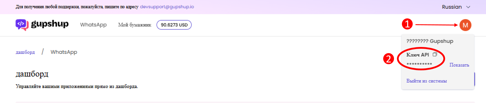

# Создание и настройка приложения WhatsApp в GupShup

### Добавление приложения WhatsApp в кабинете GupShup

Чтобы добавить новое приложение WhatsApp, в личном кабинете GupShup перейдите на страницу Дашборд. Далее, нажмите на кнопку «+ Создать приложение»:

<figure><figcaption></figcaption></figure>

Выберите тип приложения «API доступа»:

<figure><figcaption></figcaption></figure>

Укажите имя приложения и нажмите на кнопку «Отправить»:

<figure><figcaption></figcaption></figure>

После создания приложения оно отобразится на странице Дашборд в списке приложений:

<figure><figcaption></figcaption></figure>

### Подключение приложения к аккаунту Meta\*

Для подключения приложения WhatsApp к аккаунту Meta\*, в личном кабинете GupShup перейдите на страницу Дашборд. Напротив нужного приложения нажмите на кнопку «В прямом эфире»:

<figure><figcaption></figcaption></figure>

В появившемся окне выберите «Новый номер телефона» и нажмите на кнопку «Продолжить»:

<figure><figcaption></figcaption></figure>

Далее следуйте пошаговой инструкции на экране:

<figure><figcaption></figcaption></figure>

На странице 1 необходимо выбрать регион хранения данных - Индию. Также можно выбрать страну для ознакомления со стоимостью сообщений:

<figure><figcaption></figcaption></figure>

Внизу страницы нажмите на кнопку чтобы перейти к следующей странице настроек:

<figure><figcaption></figcaption></figure>

На странице 2 введите ваши контактные данные, для связи с вами по вопросам, касающимся бизнес-аккаунта WhatsApp:

<figure><figcaption></figcaption></figure>

На странице 3 проверьте контактные данные и нажмите на кнопку «Подтвердить»:

<figure><figcaption></figcaption></figure>

На странице 4 потребуется войти в аккаунт Facebook\* и выполнить создание бизнес-аккаунта Whatsapp:

<figure><figcaption></figcaption></figure>

Нажмите продолжить как ...

<figure><figcaption></figcaption></figure>

Свяжите свой аккаунт Facebook\* с Gupshup:

<figure><figcaption></figcaption></figure>

Выберите верифицированный бизнес-аккаунт Meta:

<figure><figcaption></figcaption></figure>

В списке аккаунтов выберите вариант с созданием нового аккаунта и профиля WhatsApp Business:

<figure><figcaption></figcaption></figure>

Укажите имя пользователя для аккаунта WhatsApp Business, заполните отображаемое имя профиля, укажите категорию услуг. При необходимости заполните описание компании и адрес сайта. Нажмите на кнопку «Далее»:

<figure><figcaption></figcaption></figure>

На следующем шаге укажите номер телефона WhatsApp, для которого будет создан профиль  WhatsApp Business и выберите удобный способ подтверждения номера. Нажмите на кнопку «Далее»:

<figure><figcaption></figcaption></figure>

<figure><figcaption></figcaption></figure>

<figure><figcaption></figcaption></figure>

<figure><figcaption></figcaption></figure>

Выберите номер телефона, который будет связан с приложением и нажмите на кнопку «Подтвердить»:

<figure><figcaption></figcaption></figure>

<figure><figcaption></figcaption></figure>

<figure><figcaption></figcaption></figure>

Перейдите в дашборд. В списке приложений вы увидите подключенный аккаунт:

<figure><figcaption></figcaption></figure>

### Добавление партнёра

Для добавления партнёра к приложению WhatsApp, в личном кабинете GupShup перейдите на страницу Дашборд. Выберите нужное приложение и перейдите к его настройкам. Для этого нажмите на иконку рядом с названием приложения:

<figure><figcaption></figcaption></figure>

Далее, перейдите на вкладку «Настройки» и нажмите на кнопку «Добавить партнёра»:

<figure><figcaption></figcaption></figure>

В поле ввода партнёрского ID введите значение `88` и нажмите на кнопку для подтверждения добавления. Это ID нашей компании, его необходимо вводить чтобы вы смогли подключиться к нашему приложению для интеграции.&#x20;

<figure><figcaption></figcaption></figure>

<figure><figcaption></figcaption></figure>

Убедитесь в том, что привязка к партнёру произошла успешно и в имени партнёра прописано значение `Infocom`:

<figure><figcaption></figcaption></figure>

### Получение ключа API приложения

<figure><figcaption></figcaption></figure>

Для получения ключа API необходимо нажать на "Мой профиль" в правом верхнем углу. Далее необходимо нажать кнопку "Показать", либо сразу воспользоваться кнопкой копирования ключа API "Копировать в буфер обмена".

API ключ будет скопирован в буфер и может быть использован в дальнейшей настройке при подключении коннектора в приложении Whatsabi. Подробнее в статье [#podklyuchenie-konnektora](../ustanovka-i-nastroika-prilozheniya-v-bitriks24/podklyuchenie-konnektora.md#podklyuchenie-konnektora "mention")

_(\*) Meta — признана экстремистской организацией на территории РФ._
