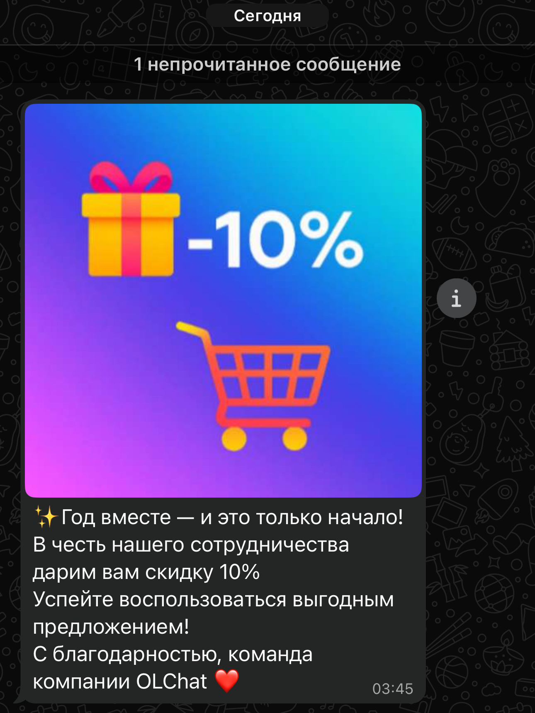
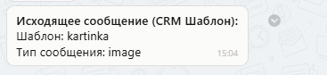

# Отправка шаблонов и сообщений из приложения в карточке

Для отправки сообщений из карточки лида, сделки, контакта или компании перейдите в карточку и выберите приложение «Whatsabi»:

<figure><figcaption></figcaption></figure>

<figure><figcaption></figcaption></figure>

### Канал 

При отправке можно выбрать канал, через который вы планируете отправлять сообщение.

### Телефон 

В списке указаны все номера, которые привязаны к карточке контакта и на которых есть аккаунт WhatsApp.

### Создание чата 

Если вы хотите создать чат открытой линии и пригласить туда сотрудников портала для общения с клиентом, нажмите на кнопку «СОЗДАТЬ ЧАТ».


При нажатии на кнопку «СОЗДАТЬ ЧАТ», создающийся чат распределяется не в общую очередь Открытой линии или на ответственного сотрудника, а сразу на его создателя.


### Шаблоны

Если вы хотите начать новый диалог с клиентом, отправьте ему шаблонное сообщение. Шаблонные сообщения – это сообщения добавленные в кабинете GupShup и заранее согласованные с Meta\* . Подробнее про создание и управление шаблонами сообщений в статье [sozdanie-i-upravlenie-shablonami-soobshenii](../../lichnyi-kabinet-gupshup/sozdanie-i-upravlenie-shablonami-soobshenii/ "mention")

После выбора нужного шаблона, он отобразится в окне предпросмотра:

<figure><figcaption></figcaption></figure>

Если выбранный шаблон содержит переменные – вы можете внести их в соответствующие поля. После заполнения в окне предпросмотра сообщения вы увидите итоговый текст отправляемого шаблонного сообщения:

<figure><figcaption></figcaption></figure>

Если выбранный шаблон предполагает использование изображений, в качестве изображения в параметр «Ссылка на изображение» может быть подставлена прямая ссылка на изображение:

<figure><figcaption></figcaption></figure>


Данный пример рассматривает отправку шаблонного сообщения с изображением, но принцип работы подходит также и под отправку шаблона с документом, аудио- или видеофайлом.


Изображение также может храниться на диске портала Битрикс24. Чтобы использовать в шаблоне сохранённое на Битрикс.Диске изображение, в поле "Ссылка на изображение" подставьте параметр:

> DISK\_<mark style="color:red;">ID</mark>

В данном параметре <mark style="color:red;">ID</mark> - это ID файла на Битрикс.Диске. Узнать ID файла можно тут:

<figure><figcaption></figcaption></figure>

Пример использования шаблона с изображением, хранящимся на Битрикс.Диске:

<figure><figcaption></figcaption></figure>

При  использовании шаблона данного типа, клиент получит следующее сообщение в WhatsApp:

<figure><figcaption></figcaption></figure>

В Открытой линии текст шаблона и изображение будут не видны. Вместо этого в чате будет информация о том, что был отправлен шаблон, и детали о нём - наименование шаблона и наличие изображения.

<figure><figcaption></figcaption></figure>


Размер изображения, отправляемого клиенту, должен быть 800×800 пикселей. В таком случае, изображение в WhatsApp, при прочтении сообщения, обрезаться не будет.



Подробнее о создании шаблонных сообщений с изображениями в статье [#sozdanie-shablona-s-izobrazheniyami](../../lichnyi-kabinet-gupshup/sozdanie-i-upravlenie-shablonami-soobshenii/#sozdanie-shablona-s-izobrazheniyami "mention")


### Стандартные сообщения 

<figure><figcaption></figcaption></figure>


Выбрать для отправки Стандартные сообщения вы можете в том случае, если у вас отрыто 24-х часовое окно переписки с клиентом. Возможность отправки Стандартного сообщения определяется с помощью таймера, который показывает оставшееся время до закрытия 24-х часового окна.


**Сообщение** — тут можете писать сообщение длиной около 1000 символов. Если нужны эмодзи, воспользуйтесь меню в правом верхнем углу.

**Файл** — для прикрепления файла выберите файл на компьютере.

**Публиковать в чате** — если значение активно, то отправленное сообщение будет опубликовано и в чате открытой линии, и в таймлайне карточки сущности. Если чат открытой линии не был создан до этого, то он будет создан после публикации сообщения. Если данная настройка отключена, отправленное сообщение будет видно только в таймлайне карточки.

_(\*) Meta — признана экстремистской организацией на территории РФ._
