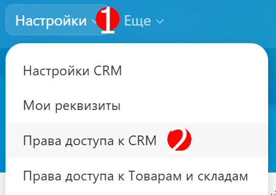

# Отправка сообщений из мобильного приложения Битрикс24

Для того, чтобы отправить сообщение клиенту из мобильного приложения Битрикс24 через OLChat WABA, необходимо проделать следующие действия:



#### В случае, если с клиентом не открыто 24-часовое окно диалога, то есть за последние сутки вы не использовали WABA для общения с клиентом, диалог необходимо начать с отправки шаблона.


Чтобы создать шаблон, воспользуйтесь [данной ](../../lichnyi-kabinet-gupshup/sozdanie-i-upravlenie-shablonami-soobshenii/)инструкцией.


Чтобы скопировать шаблон, выполните следующее:

1. Зайдите с веб-версии Битрикс24 в карточку лида, выберите "Whatsabi".
2. Укажите коннектор, к которому привязан шаблон, затем перейдите во вкладку "Шаблоны".
3. Выберите желаемый шаблон из выпадающего списка, далее нажмите "Скопировать шаблон".

<figure><figcaption></figcaption></figure>

<figure><figcaption></figcaption></figure>

Сохраните шаблон на мобильном устройстве в удобном месте, например, в личных заметках на портале Битрикс24, либо попросите коллег выслать вам необходимый шаблон.



#### Откройте CRM своего портала Битрикс24 в мобильном приложении и воспользуйтесь поиском по лидам, сделкам или контактам, чтобы найти необходимого клиента.

Например, найти клиента можно по сохраненному имени в карточке лида, названию сделки или по номеру телефона (вводите номер в любом формате - начиная с 7, +7 или 8).

<figure><figcaption></figcaption></figure>


Если у вас отсутствует кнопка CRM в нижнем меню мобильной версии Битрикс24, измените настройки отображения пунктов: выберите "Ещё" в нижнем меню - "Нижнее меню" - "Своё меню".&#x20;




#### В карточке клиента перейдите в "Таймлайн", затем нажмите кнопку  и выберите "Отправить СМС".

<figure><figcaption></figcaption></figure> <figure><figcaption></figcaption></figure>




#### В открывшемся окне нажмите на , чтобы указать коннектор, к которому привязан шаблон, и с помощью которого будет отправлено сообщение клиенту, а также выберите СМС-сервис.

<figure><figcaption></figcaption></figure> <figure><figcaption></figcaption></figure>




### В текстовое поле вставьте скопированный шаблон и нажмите "Отправить".


Если шаблон содержит переменные, не забудьте указать их!


<figure><figcaption></figcaption></figure>



#### Клиент получит сообщение на WhatsApp следующего вида:

<figure><figcaption></figcaption></figure>


