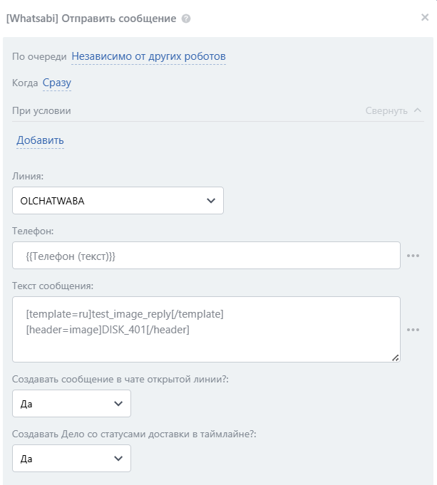

# Отправить сообщение или шаблон


Обратите внимание, что переменная **\{{Телефон\}} / \{{Контакт: Телефон\}} / \{{Компания: Телефон\}}** или **\{{Телефон (текст)\}} / \{{Контакт: Телефон (текст)\}} / \{{Компания: Телефон (текст)\}}** собирает и передаёт номера ВСЕХ типов.

**Если в робот или активити бизнес-процесса передан подобный массив номеров или текстовая строка с номерами и их там несколько – отправка будет осуществлена на первый номер в списке, на котором есть WhatsApp!**



В качестве текста сообщения вы можете использовать шаблонные сообщения, если хотите начать новый диалог с клиентом, либо сообщения написанные в свободной форме, если у вас отрыто 24-х часовое окно переписки с клиентом.

Подробнее о шаблонных сообщениях в статьях [sozdanie-i-upravlenie-shablonami-soobshenii](../../lichnyi-kabinet-gupshup/sozdanie-i-upravlenie-shablonami-soobshenii/ "mention") и [poluchenie-parametrov-shablonov.md](../../vozmozhnosti/poluchenie-parametrov-shablonov.md "mention")


## Настройка робота 

Для отправки сообщения добавьте робота «\[Whatsabi] Отправить сообщение». Для этого перейдите в **Роботы ‒ Создать ‒ Выбор стадии ‒ Другие роботы ‒ \[Whatsabi] Отправить сообщение ‒ Добавить.**

<figure><figcaption></figcaption></figure>

Выполните настройку робот&#x430;**.** Для этого на добавленном роботе нажмите на кнопку «изменить», чтобы открыть интерфейс редактирования робота:

1. Укажите **Линию,** через которую планируете сделать отправку
2. Введите **Телефона**, на который необходимо отправить сообщение
3. Введите **Текст сообщения**

<figure><figcaption></figcaption></figure>

Остальные настройки можно оставить по умолчанию. Нажмите на кнопку «СОХРАНИТЬ»

Также сейчас есть возможность прикрепить файл к сообщению.&#x20;

Для этого в текст необходимо загрузить файл на Диск в Битрикс24. ID файла необходимо вставить в текст сообщения, как показано на скриншоте ниже.


Данный способ работает с файлами формата "jpg" и "png".&#x20;


<figure><figcaption></figcaption></figure>

## Настройка активити (действия) бизнес-процесса

Для отправки сообщения из бизнес-процесса добавьте действие «\[Whatsabi] Отправить сообщение». Выполните настройку параметров действия:

<figure><figcaption></figcaption></figure>

1. Укажите **Линию,** через которую планируете сделать отправку
2. Введите **Телефона**, на который необходимо отправить сообщение
3. Введите **Текст сообщения**

<figure><figcaption></figcaption></figure>

Остальные настройки можно оставить по умолчанию. Нажмите на кнопку «Сохранить».
