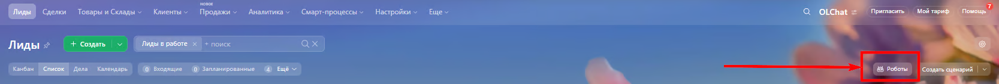

# Виджет на сайт

Для добавления виджета WhatsApp на ваш сайт в левом меню портала войдите в приложение **Whatsabi.** Выберите нужный коннектор и разверните раздел меню **Настройка виджета на сайт:**

<figure><figcaption></figcaption></figure>

Укажите текст приветствия в соответствующем поле. Нажмите на кнопку «УСТАНОВИТЬ».

Также вы можете скопировать ссылку на чат в WhatsApp, нажав на иконку «Скопировать ссылку» в разделе «Ссылка на чат в WhatsApp»

<figure><figcaption></figcaption></figure>

Далее перейдите в **Контакт-центр — Виджет на сайт**.

<figure><figcaption></figcaption></figure>

Включите канал в настройках виджета:

<figure><figcaption></figcaption></figure>

Если у вас уже существует и настроена линия с каким-то набором подключенным каналов, вы можете подключить к ней канал из другой линии. Это может пригодиться в случае, если для приложения Whatsabi вы использовали отдельную открытую линию со своим сценарием обработки и распределения входящих сообщений от клиентов.

Для добавления канала WhatsApp из открытой линии подключенной к приложению Whatsabi, в настройках виджета нажмите ссылку «добавить открытую линию».

<figure><figcaption></figcaption></figure>


После установки виджет может появиться на сайте не сразу, т.к. он кэшируется на стороне Битрикс24. Чаще всего такое случается на коробочных версиях Битрикс24. Обновляться виджет может в течение 15-60 минут.

Для ускорения обновления данных в виджете рекомендуем выключать и включать виджет. Тогда кэш виджета обновляется быстрее и применяются новые настройки.

